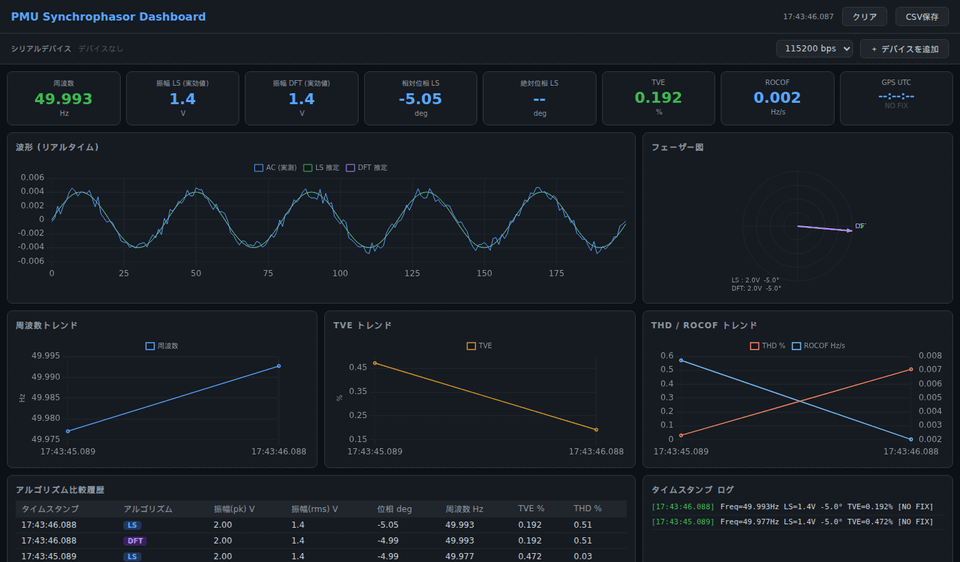

# PMU Synchrophasor Dashboard

STM32F446RE (Nucleo) を使用した IEEE C37.118.1 準拠の PMU (Phasor Measurement Unit) 実装と、リアルタイム可視化ダッシュボードです。



---

## 概要

| 項目 | 内容 |
|---|---|
| MCU | STM32F446RE (Nucleo-F446RE) |
| GPS | Waveshare L76K GPS HAT |
| サンプリング周波数 | 2000 Hz |
| バッファサイズ | 200 サンプル (100 ms) |
| 対応系統周波数 | 50 Hz / 60 Hz |
| フェーザー推定 | LS法 (最小二乗) + DFT法 |
| 時刻同期 | GPS PPS (1秒パルス) による絶対フェーザー |

---

## ハードウェア構成

### 必要なもの

- STM32F446RE Nucleo ボード
- Waveshare L76K GPS HAT (または互換GPS モジュール)
- アナログ信号センサー (変換比 500:1)
- USB Type-A to Mini-B ケーブル
- ジャンパーワイヤー

### ピン接続

#### アナログ入力 (センサー)

```
交流電圧/電流
      │
   センサー (変換比 500:1)
      │
  DCバイアス回路 (目標: 1.65V = VDDA/2)
      │
   PA0 (Nucleo CN7 pin28) ← ADC1_IN0
```

#### GPS L76K HAT → Nucleo

```
L76K 40ピンヘッダー      Nucleo
─────────────────────────────────────
Pin 1  (3.3V)  ────→  3.3V (CN6 pin3)
Pin 6  (GND)   ────→  GND  (CN6 pin2)
Pin 7  (1PPS)  ────→  PA1  (CN7 pin24)  ← TIM5_CH2 入力キャプチャ
Pin 8  (TXD)   ────→  PA10 (CN10 pin33) ← USART1_RX
```

#### PC通信 (USB)

```
Nucleo USB ────→ PC (ST-Link 仮想COMポート, 115200 bps)
```

---

## ファームウェア機能

### 計測・解析

| 機能 | アルゴリズム |
|---|---|
| フェーザー推定 (相対) | LS法 (最小二乗) |
| フェーザー推定 (比較用) | DFT法 |
| **絶対フェーザー** | **GPS PPS 基準 UTC 同期** |
| 周波数推定 | ゼロクロス法 + 外れ値除外 |
| ROCOF | 周波数差分 |
| TVE | IEEE C37.118.1 準拠 (LS基準・DFT評価) |
| 高調波解析 | DFT 2次・3次 + THD |

### GPS同期

```
GPS PPS (1Hz) ──→ TIM5_CH2 入力キャプチャ
                      │
                  ppsCapture 記録 (90 MHz 分解能 ≈ 11 ns)
                      │
              バッファ先頭サンプル時刻との差分
                      │
              絶対位相 = 相対位相 − UTC基準コサイン位相
```

---

## ダッシュボード

Chrome / Edge でそのまま開けるシングルファイル HTML です。

```
pmu_dashboard.html をブラウザで開く
```

### 機能一覧

| パネル | 内容 |
|---|---|
| KPI カード | 周波数・振幅(LS/DFT)・相対位相・**絶対位相**・TVE・ROCOF・**GPS UTC/Lock** |
| 波形チャート | AC実測・LS推定・DFT推定 (200サンプルリアルタイム) |
| フェーザー図 | LS・DFT ベクトル描画 |
| 周波数トレンド | 直近60点 |
| TVE / THD / ROCOF トレンド | 直近60点 |
| アルゴリズム比較テーブル | LS vs DFT 履歴 |
| タイムスタンプログ | ミリ秒単位・GPS UTC 付き |
| CSV保存 | 全計測履歴をワンクリックでダウンロード |

### シリアル接続手順

1. Chrome または Edge でダッシュボードを開く (Firefox は WebSerial 非対応)
2. **「＋ デバイスを追加」** ボタンを押す
3. ブラウザのポート選択ダイアログで Nucleo の COM ポートを選択
4. **「接続」** ボタンを押す (115200 bps)

> デバイスパネルに `🔵 STM32 Nucleo` と表示されれば認識成功。  
> 接続すると自動でデモモードが停止し、実データに切り替わります。

---

## ビルド手順

### 1. 必要なもの

- STM32CubeIDE 1.14+
- STM32Cube FW_F4 V1.28+

### 2. ビルド

```
STM32CubeIDE でプロジェクトを開く
→ Project → Build Project
→ Run → Run
```

### 3. float printf 有効化 (初回のみ)

`Project → Properties → C/C++ Build → Settings → MCU GCC Linker → Miscellaneous → Other flags`

```
-u _printf_float
```

---

## シリアル出力フォーマット

### PLOT_MODE=0 (デフォルト: 波形)

```
AC:0.0012,LS_est:0.0011,DFT_est:0.0011   ← 200行
========================================
  PMU Synchrophasor Measurement Result
========================================
Frequency      : 50.012 Hz  [正常 50Hz]
ROCOF          : 0.0001 Hz/s
Abs Phase (LS) : -12.345 deg  [UTC基準]
GPS Lock       : LOCKED
UTC            : 12:34:56
TVE            : 0.234 %  [合格 <=1%]
...
```

### PLOT_MODE=1 (フェーザー情報)

```
Amp_LS:220.00,Amp_DFT:219.50,...,AbsPhase_LS:-12.345,UTC:12:34:56,GPS_LOCK:1
```

---

## ライセンス

MIT License

---

## 参考規格

- IEEE Std C37.118.1-2011: *IEEE Standard for Synchrophasor Measurements for Power Systems*
- NMEA 0183: GPS GPRMC センテンス
